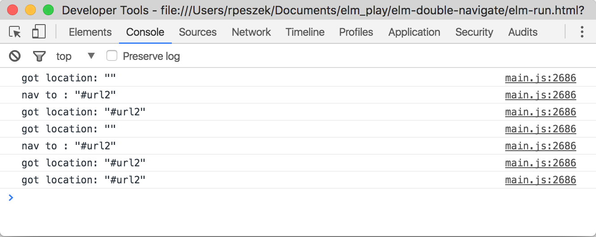

Run it in Chrome either using elm-reactor pointing to src/Main.elm or compiled (elm-run.html).
Click on both buttons several times, examine the console to see what happens.

__Steps (in Chrome):__  
1.  On first "url2" button click the page reloads (the form is actually submitted).
I found this behavior intermittent, but the real issue described in (2) happens more regularly.

2.  On consecutive clicks, the ```
Location -> Msg 
``` function (first parameter of Navigation.program) is called twice!  
And the full chain of program calls is triggered as well.

3. Try different sequences of clicking the "Root" and "Url2" buttons to see how URL is intermittently dispatched to different hash-places.



__Other browsers:__  
Safari tends to submit the form (refresh the page) every time. Did not test any other browsers.

__Work-around:__  
Keep the button outside of Http.from if used for navigation.
